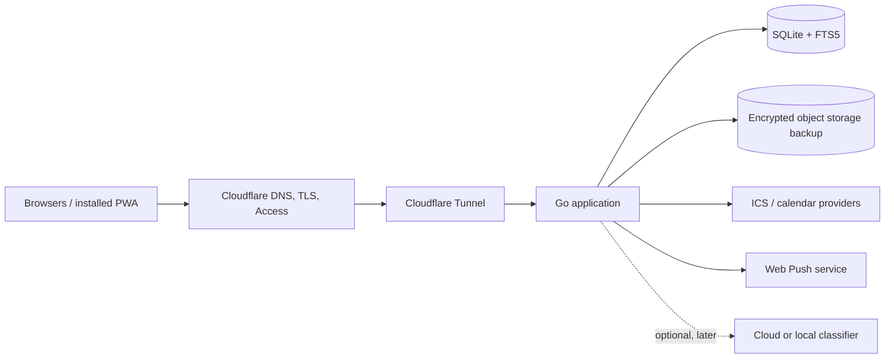
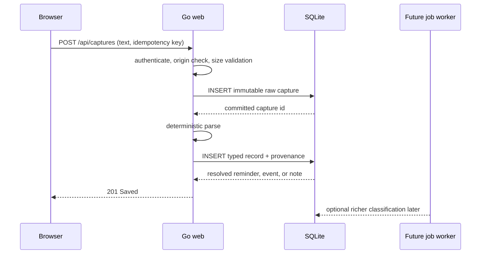

# Dashboardify system architecture

## Decision summary

Build a **single-user modular monolith**:

- Go HTTP/API server with a React + TypeScript client compiled by Vite and embedded in the binary.
- SQLite in WAL mode as the authoritative store.
- SQL migrations and generated/query-checked data access; no general ORM.
- Durable database-backed jobs for parsing, notifications, imports, backups, and later model calls.
- Cloudflare Tunnel plus Cloudflare Access for the first deployment, with Access JWT validation in the application and an allowlisted identity subject.
- Installable responsive PWA; network-required writes in the initial release.
- Encrypted continuous SQLite replication to S3-compatible object storage and periodic restore drills.

This keeps idle resource use and operations small while retaining a clean path to PostgreSQL if multi-user access or write concurrency becomes real.

## Why this shape

### Go service with an embedded client application

A single Go process provides predictable memory use, fast startup, straightforward concurrency, and one deployable binary. React owns interactive screen composition, capture preview state, keyboard commands, and responsive navigation. Vite emits hashed production assets; Go embeds and serves them under the same authenticated origin, so the deployment does not require a Node runtime or separate static host.

### SQLite before PostgreSQL

The initial system has one user and low write concurrency. SQLite removes a second always-on service, transactionally stores the full product model, and supports full-text search through FTS5. WAL mode permits concurrent readers while serializing the limited writes.

Move to PostgreSQL only when evidence shows one of these:

- multiple independent users or household sharing;
- sustained concurrent writers causing measurable queueing;
- hosting without a reliable persistent volume;
- operational needs that require database-native replication or row-level security.

Do not build a generic storage abstraction pre-emptively. Keep SQL in a dedicated package, avoid SQLite-only behavior in domain decisions, and isolate the few FTS/job-claim queries known to differ.

### Client-rendered shell without a second application server

Today, Inbox, Calendar, Notes, People, and Settings share one persistent responsive shell and enough interactive state to justify React. Server state remains authoritative: the client consumes narrow JSON endpoints and does not duplicate domain rules, parsing, or persistence. Routing can remain server-addressable as surfaces are added; choosing React does not require moving business decisions into the browser.

## Context diagram



The origin listens on a private interface or container network and is not directly internet-routable. Cloudflare is not the only authorization check: the application validates the Access token and its subject/audience before creating its own short-lived session.

## Runtime modules

One process, explicit packages, no network calls between modules:

| Module | Owns | Does not own |
| --- | --- | --- |
| `identity` | Access/OIDC token validation, user binding, sessions, CSRF | feature permissions or record content |
| `capture` | immutable raw capture, idempotency, classification state, provenance | direct model/provider behavior |
| `tasks` | task state, due/reminder semantics, recurrence references | browser notification delivery |
| `calendar` | native events, recurrence, external event projection | provider credentials outside integration storage |
| `notes` | note bodies and safe Markdown rendering | arbitrary HTML |
| `entities` | people, places, aliases, facts, record links | contact synchronization initially |
| `habits` | habit definitions, schedules, activity/workout logs | medical or coaching logic |
| `search` | FTS projection and ranked retrieval | source-of-truth content |
| `integrations` | provider credentials, sync cursors, import/export adapters | core record semantics |
| `notifications` | scheduled delivery attempts and in-app fallback | task/event ownership |
| `jobs` | persistence, leases, retry policy, dead-letter state | domain-specific execution logic |
| `web` | React/TypeScript shell, shadcn/ui source components, Vite assets, API client | domain parsing, persistence, or authorization decisions |

Module boundaries are enforced through Go packages and transactions, not interfaces everywhere. Introduce an interface only for an external provider, clock/randomness in tests, or a boundary with two real implementations.

## Request and capture flow



Critical invariant: raw text is committed before classification. A parser or typed-record failure leaves a durable pending capture that the same idempotent request can safely retry.

### Deterministic parser first

The initial parser is intentionally bounded but accepts equivalent natural phrasing rather than exact templates:

1. Explicit prefixes and reminder cues such as `task:`, `remind me to`, `remember to`, and `don't forget to` select reminder intent.
2. `event:`, `schedule`, `@ <time>`, or an otherwise unqualified scheduled phrase selects event intent.
3. Weekdays, `today`, `tomorrow`, common 12/24-hour clock forms, and trailing `at <place>`/`in <place>` are extracted against the configured home timezone. A reminder date without a time is stored as a local calendar date with `all_day=true`, never converted through UTC midnight.
4. Bare hours from one through seven resolve to PM; highlighted interpretation is visible before submission. Explicit `am`/`pm` always wins.
5. `note:` forces note intent; unmatched text becomes a note rather than being discarded.

Parsing returns the proposed type, normalized fields, and source-text spans. The browser highlights those spans without rewriting input. The immutable raw capture retains the original phrase and timezone context so interpretation can be audited or corrected.

### Model classifier later

Define a versioned schema such as:

```json
{
  "schema_version": 1,
  "record_type": "fact",
  "fields": {
    "subject_text": "Sam",
    "statement": "likes Ethiopian food"
  },
  "confidence": 0.94,
  "assumptions": [],
  "questions": []
}
```

The model receives bounded capture text and relevant candidate entities only. Its output is schema-validated, size-limited, stored as an untrusted proposal, and rendered as text rather than HTML. Provider timeout or malformed output leaves the capture in Inbox. No model receives database credentials or invokes feature functions.

## Data architecture

Use UUIDv7 identifiers generated by the server for sortable, globally safe IDs. Use integer microseconds or RFC 3339 consistently at the SQL boundary; never mix representations within tables. Every mutable source record has `created_at`, `updated_at`, and a version used for optimistic concurrency.

Core table groups:

```text
identity
  users, sessions, audit_events

capture
  captures, capture_proposals, capture_resolutions

planning
  tasks, task_recurrences, events, event_recurrences, reminders

knowledge
  notes, entities, entity_aliases, facts, record_links, tags, record_tags

tracking
  habits, habit_schedules, activity_logs, workouts

integration
  integrations, external_records, sync_runs

operation
  jobs, notification_deliveries, schema_migrations

search
  search_documents (FTS5 virtual table + rebuildable projection)
```

### Important constraints

- `captures(user_id, idempotency_key)` is unique.
- Typed records reference their source capture where applicable; one capture may resolve to several records only after explicit confirmation.
- External records are unique by `(integration_id, external_id, external_revision)` or a provider-appropriate stable key.
- Activity logs use occurrence time separately from creation time.
- Facts are superseded by linkage; history is not overwritten.
- Soft deletion has a timestamp and retention policy. Unique constraints account for archived values deliberately.
- Search indexes contain no data that is not present in source tables and can be rebuilt transactionally.

### SQLite configuration

At connection initialization:

- `PRAGMA journal_mode=WAL;`
- `PRAGMA foreign_keys=ON;`
- `PRAGMA busy_timeout=5000;`
- `PRAGMA synchronous=NORMAL;` after confirming backup/recovery requirements;
- bounded connection pool: one writer path and a small reader count;
- checkpointing monitored rather than run on every request.

Use transactions around domain changes and job creation together—the outbox/job row is committed with the change that requires it.

## HTTP and UI boundary

Production UI stack:

- Go standard `net/http`; add a router only if standard patterns stop being clear.
- React and TypeScript built with Vite.
- shadcn/ui source components on Radix primitives, with Lucide icons and project-owned composition.
- Tailwind CSS v4 for utility generation plus adaptive custom properties and semantic layout CSS.
- Vite's hashed build output embedded in the Go binary; no Node runtime in production.
- JSON capture endpoints protected by the same Cloudflare Access middleware, origin checks, and custom mutation header as the shell.

Representative routes:

```text
GET  /today/:date
GET  /inbox
POST /captures
GET  /captures/:id/proposal
POST /captures/:id/file
POST /tasks/:id/complete
POST /tasks/:id/defer
GET  /calendar/week/:date
GET  /search?q=&type=&from=&to=
GET  /people/:id
POST /activities
GET  /settings/security
POST /exports
```

The browser uses JSON endpoints for interactive reads and mutations. Write endpoints require authentication, expected origin, JSON content type, a bounded body, and an idempotency or optimistic-concurrency key where retries or concurrent edits matter. Domain interpretation stays in Go; React renders server proposals rather than reimplementing the parser.

## Authentication and authorization

### First deployment

1. Cloudflare Access policy permits only the configured identity through an OIDC provider that supports strong MFA/passkeys.
2. Cloudflare Tunnel is the sole ingress. The origin firewall does not expose the application port publicly.
3. The Go application validates the signed Access JWT against pinned audience and issuer values, verifies expiry, and binds the stable `sub` to the sole local user.
4. After validation, the application issues a short-lived opaque session cookie backed by the `sessions` table. Session rotation occurs at login and privilege-sensitive actions.
5. Unknown subjects are denied, even when an email address matches.

This allows macOS, Linux, work, and mobile browsers without iCloud. If Cloudflare Access becomes undesirable, replace the edge validator with standards-based OIDC; the local session and user binding remain unchanged.

### Controls

- Secure, HTTP-only, `SameSite=Lax` session cookie; stricter mode where it does not break the identity callback.
- CSRF token bound to session plus Origin/Referer validation for mutations.
- Rate limits on login callback, capture, search, import, and export.
- 1 MiB default request limit; lower limits on capture and ordinary forms.
- CSP with nonces or hashed static script; no inline event handlers.
- HSTS at the edge and origin-aware secure URL generation.
- Session list and revoke-all action in Security settings.
- Metadata-only audit entries for login, logout, failed identity binding, export, integration changes, and deletion.
- Secrets mounted through the host secret store; calendar/model tokens encrypted at rest with a separate key.

Do not add password authentication to the app unless operating without an identity provider becomes a firm requirement. Password reset, MFA, breach handling, and credential storage would expand the security surface substantially.

## Background jobs

A `jobs` table is enough initially. Each row has type, versioned payload, availability time, lease owner/expiry, attempt count, and terminal error metadata. Workers lease with a short transaction, perform external work outside the transaction, then commit result and completion. Handlers are idempotent.

Queues are logical priorities:

1. reminders/notifications;
2. capture classification;
3. user-triggered imports/exports;
4. periodic sync and search rebuild;
5. maintenance/backup verification.

Interactive HTTP handlers never wait for these jobs. Exponential backoff is bounded, terminal failures appear in System status, and poison jobs cannot spin.

## Search

SQLite FTS5 indexes normalized display text from notes, captures, tasks, events, entities, facts, and places. A search projection row stores record type/id plus indexed text; authorization still applies when hydrating results. Prefix matching is restricted to avoid expensive broad queries. Results are capped and paginated by a stable cursor.

Relevance combines FTS rank, exact title/name match, and a modest recency adjustment. Do not send search queries to a model in the initial product.

## Calendar and recurrence

Store recurrence as RFC 5545 RRULE plus explicit timezone, start, duration, exclusions, and overrides. Expand occurrences only for the requested bounded window; never materialize an unbounded recurrence. External read-only records retain provider payload version/hash and map into a projection without pretending to be native writable events.

Two-way synchronization is deferred because deletion, concurrent edits, recurrence exceptions, and provider-specific sequence rules need an explicit conflict contract.

## Notifications

Browser notification support is best-effort, not the source of truth. Reminder records remain visible in Today and an in-app notification list. Web Push subscriptions are per device, encrypted at rest, revocable, and pruned after permanent delivery failures. Notification bodies default to a privacy-preserving generic message, with an opt-in setting for titles.

A scheduler queries a bounded indexed window and creates idempotent delivery jobs. Exact-once external delivery is impossible; deduplication keys prevent normal retries from producing duplicates.

## PWA and offline behavior

The first service worker caches only versioned static assets and an offline shell explaining connectivity. Authenticated HTML and API responses use `Cache-Control: private, no-store` and are not placed in Cache Storage. Captures require a live committed response; the UI must never imply an offline draft was durably saved.

Later offline capture is possible, but requires encrypted local storage, device threat decisions, an outbox, conflict handling, and clear unsynced state. It is deliberately outside the first release.

## Deployment profiles

### Recommended initial: home server or small VM through Cloudflare Tunnel

```text
container/process
  dashboardify (Go binary, loopback/private port)
  cloudflared
persistent volume
  dashboardify.db + WAL/SHM
external
  Cloudflare Access
  encrypted S3-compatible backup bucket
```

Run as a non-root user with a read-only root filesystem where practical. Only the data directory is writable. Add a process supervisor/container restart policy, resource limits, and graceful shutdown that stops accepting requests before closing database connections.

### Conventional cloud host

Use a small VM or container host with a persistent volume and the same Cloudflare Access front door. Avoid serverless platforms with ephemeral filesystems while SQLite is authoritative. If the chosen platform cannot guarantee single-writer attachment and durable local volume, use managed PostgreSQL instead of attempting network-mounted SQLite.

## Backup and recovery

- Continuously replicate SQLite pages/WAL to encrypted, versioned object storage with a dedicated least-privilege credential.
- Retain daily and weekly recovery points according to an explicit policy.
- Periodically run `PRAGMA integrity_check` away from latency-sensitive requests.
- A restore command creates a new data directory, restores to a chosen point, verifies schema/integrity, and starts without contacting integrations.
- Quarterly or after schema-risk changes, restore into a disposable instance and verify capture, Today, search, and export.
- Export is user portability, not a substitute for operational backup.

## Observability

Keep it small and private:

- JSON logs: request ID, route name, status, duration, user internal ID, job type, attempt, error class. Never raw URLs with query strings, capture text, note bodies, model prompts, or notification content.
- Metrics: request latency/status, active sessions, DB busy duration, WAL size, job depth/age/failures, sync age, notification failures, backup age.
- `/live` proves only the process is running. An authenticated `/system` page shows DB, job, integration, and backup health.
- No third-party session replay or behavioral analytics.

## Performance plan

Budgets are verified with representative seeded data, not assumed:

| Path | Target |
| --- | --- |
| Capture commit | p95 < 200 ms server time |
| Today HTML | p95 < 300 ms with 100k records |
| Inbox first page | p95 < 250 ms |
| Search first page | p95 < 400 ms |
| Initial compressed assets | < 200 KiB excluding optional font |
| Idle application RSS | < 100 MiB |

Indexes begin with observed access paths: task status/due, event time range, capture resolution/created, activity occurrence/habit, reminder due/delivery, external integration/key, and job availability/lease. Use `EXPLAIN QUERY PLAN` on the representative dataset before accepting Today, Inbox, Calendar, and Search queries.

## Security threat notes

| Threat | Primary mitigation |
| --- | --- |
| Public origin bypasses Access | tunnel-only ingress, host firewall, app validates Access JWT |
| Stolen browser cookie | short lifetime, secure cookie, server-side revoke, session rotation |
| Cross-site mutation | SameSite cookie, CSRF token, origin validation |
| Stored script in notes/model output | safe Markdown allowlist, escaped templates, CSP |
| Sensitive logs/backups | content redaction, encrypted bucket, least privilege, retention |
| Model prompt injection | model only proposes schema; no tools/credentials/direct writes |
| Import bomb/pathological recurrence | body/file limits, bounded parsing, bounded recurrence window, async jobs |
| SSRF through integrations | fixed provider endpoints, URL validation, restricted egress where practical |
| Work-device cache leakage | no-store private responses, generic notifications, explicit logout/revoke |

## Evolution boundaries

- **Native client:** add documented JSON endpoints and device-scoped tokens only when a real client exists.
- **PostgreSQL:** port SQL and migrations after a trigger criterion; keep IDs and domain rules unchanged.
- **Local classifier:** implement the same versioned proposal contract behind a provider interface.
- **Multi-user:** requires authorization on every aggregate, sharing semantics, migrations, and threat-model revision; it is not a feature flag.
- **Offline writes:** requires encrypted client storage and conflict semantics; do not bolt it onto the service worker cache.

## Architecture implementation sequence

1. Prove the production identity path and tunnel with a protected empty route.
2. Establish migrations, SQLite settings, capture commit, and restore tooling.
3. Build and embed the React/Vite shell and versioned assets within transfer and memory budgets.
4. Add durable jobs, deterministic parsing, and Inbox filing.
5. Build Today queries against representative volume and inspect query plans.
6. Add feature modules in roadmap order.
7. Add external providers only after timeout, retry, idempotency, privacy, and status behavior are defined for each.
